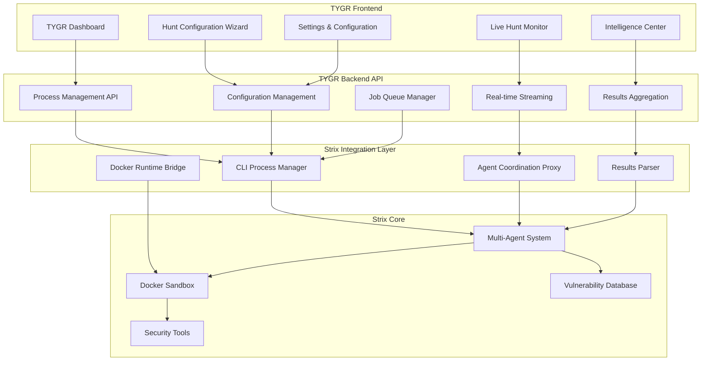
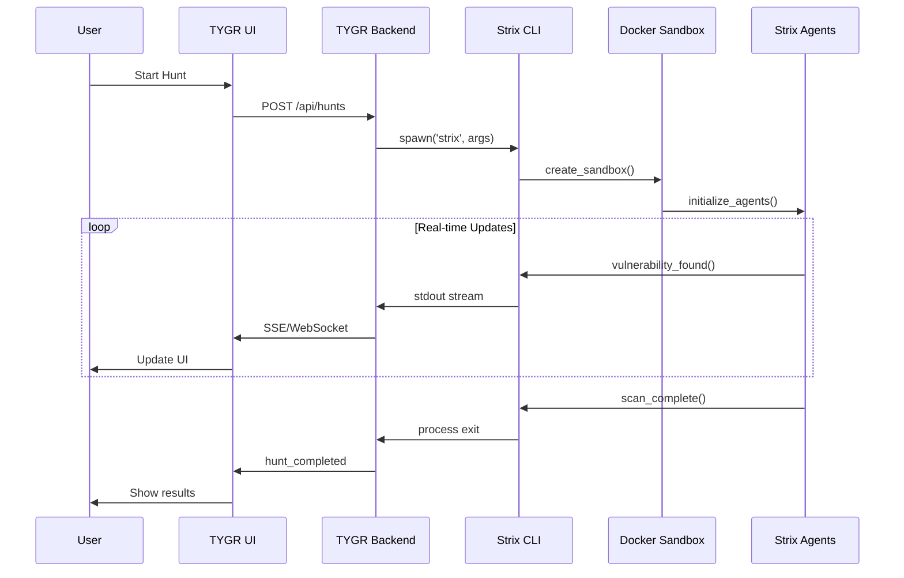

# TYGR Security Agent - Technical Architecture & Implementation Plan

## Executive Summary

TYGR Security Agent is a production-grade React/Next.js UI wrapper for the Strix CLI security testing tool, designed to match enterprise security platforms like Snyk and Burp Suite while maintaining Strix's developer-first philosophy.

## 1. Codebase Analysis & Strix Architecture Mapping

### 1.1 CLI Architecture Analysis

**Entry Points:**
- [`strix/interface/main.py`](strix/interface/main.py:449) - Main CLI entry point with argument parsing
- [`strix/interface/cli.py`](strix/interface/cli.py:17) - CLI execution logic with real-time vulnerability display

**Key CLI Arguments Mapped:**
- `--target` (multiple supported): URLs, repositories, local directories, domains, IPs
- `--instruction`: Custom penetration testing instructions
- `--run-name`: Custom run identifier
- `--non-interactive`: Headless mode for CI/CD

**Environment Variables Required:**
- `STRIX_LLM`: Model name (e.g., "openai/gpt-5")
- `LLM_API_KEY`: Provider API key
- `LLM_API_BASE`: Custom API base for local models
- `PERPLEXITY_API_KEY`: Web search capabilities

### 1.2 Multi-Agent Coordination System

**Agent Architecture:**
- Root agent spawns specialized sub-agents for different vulnerability types
- Agent tree structure with parent-child relationships
- Real-time inter-agent messaging via [`agents_graph_actions`](strix/tools/agents_graph/agents_graph_actions.py:286)

**Agent Lifecycle:**
1. **Discovery Agent** → finds potential vulnerabilities
2. **Validation Agent** → creates PoC and confirms exploitability  
3. **Reporting Agent** → generates vulnerability reports
4. **Fixing Agent** → (white-box only) implements code fixes

**Key Agent Tools:**
- [`create_agent()`](strix/tools/agents_graph/agents_graph_actions.py:188) - Spawn new agents
- [`send_message_to_agent()`](strix/tools/agents_graph/agents_graph_actions.py:286) - Inter-agent communication
- [`agent_finish()`](strix/tools/agents_graph/agents_graph_actions.py:357) - Sub-agent completion
- [`finish_scan()`](strix/tools/finish/finish_actions.py:153) - Root agent completion

### 1.3 Docker Sandbox Integration

**Container Management:**
- [`DockerRuntime`](strix/runtime/docker_runtime.py:21) manages container lifecycle
- Shared `/workspace` directory across all agents
- Tool server running on dynamic ports for agent communication
- Resource isolation with shared proxy history

**Sandbox Tools:**
- Browser automation via Playwright
- Terminal sessions with command execution
- Python runtime for custom exploits
- HTTP proxy for traffic inspection

### 1.4 Tool Ecosystem Analysis

**Available Security Tools:**
- **Reconnaissance**: nmap, subfinder, httpx, gospider
- **Vulnerability Assessment**: nuclei, sqlmap, zaproxy, wapiti
- **Web Fuzzing**: ffuf, dirsearch, katana, arjun
- **Code Analysis**: semgrep, bandit, trufflehog

**Core Tool Categories:**
- [`browser_actions`](strix/tools/browser/browser_actions.py:182) - Web interaction and testing
- [`terminal_actions`](strix/tools/terminal/terminal_actions.py:9) - Command execution
- [`python_actions`](strix/tools/python/python_actions.py) - Custom exploit development
- [`proxy_actions`](strix/tools/proxy/proxy_actions.py) - HTTP traffic manipulation

## 2. TYGR Technical Architecture

### 2.1 Core Technology Stack

```
Frontend:
├── Next.js 14+ (App Router, Server Actions, Streaming)
├── TypeScript (strict mode)
├── TanStack Query v5 (server state)
├── Zustand (client state)
├── Tailwind CSS + shadcn/ui
├── Framer Motion (animations)
├── Monaco Editor (code editing)
├── D3.js (visualizations)
└── xterm.js (terminal emulation)

Backend:
├── Next.js API Routes
├── Socket.io (real-time updates)
├── BullMQ (job queuing)
├── Docker SDK (container management)
└── Child Process (CLI execution)
```

### 2.2 System Architecture Diagram



### 2.3 Real-time Data Flow



## 3. TYGR UI Component Architecture

### 3.1 Core Application Structure

```
app/
├── layout.tsx              # Root layout with TYGR branding
├── page.tsx                # TYGR Dashboard (Mission Control)
├── hunts/
│   ├── page.tsx            # Hunt History & Management
│   ├── new/
│   │   └── page.tsx        # Hunt Configuration Wizard
│   └── [id]/
│       ├── page.tsx        # Hunt Details & Monitoring
│       └── results/
│           └── page.tsx    # Results Analysis
├── intelligence/
│   ├── page.tsx            # Vulnerability Library
│   └── compliance/
│       └── page.tsx        # Compliance Mapping
├── settings/
│   ├── page.tsx            # Global Settings
│   ├── llm-providers/
│   │   └── page.tsx        # LLM Configuration
│   └── docker/
│       └── page.tsx        # Docker Management
└── api/
    ├── hunts/
    │   ├── route.ts        # Hunt management API
    │   └── [id]/
    │       └── stream/     # Real-time hunt streaming
    ├── agents/
    │   └── route.ts        # Agent coordination API
    └── results/
        └── route.ts        # Results processing API
```

### 3.2 TYGR Design System

**Color Palette:**
- Primary: Tiger Orange (#FF8C00) + Black (#000000)
- Secondary: Security-focused blues and reds
- Status Colors: Critical (red), High (orange), Medium (yellow), Low (blue), Info (gray)

**Typography:**
- Headings: "Inter" - Modern, security-focused
- Body: "JetBrains Mono" - Developer-friendly monospace
- UI: "SF Pro" - Clean, professional

**Component Library:**
- `SeverityBadge` - Color-coded vulnerability indicators
- `AgentStatus` - Real-time agent state visualization  
- `HuntCard` - Hunt summary with progress indicators
- `LogViewer` - ANSI-colored terminal output
- `VulnerabilityTable` - Sortable/filterable findings grid

## 4. Implementation Phases

### Phase 1: TYGR Project Setup & Architecture (Week 1)
- Initialize Next.js 14+ with TypeScript and modern tooling
- Set up TYGR design system and component library
- Configure real-time communication infrastructure
- Create project structure and development environment

### Phase 2: Backend API Layer (Week 2)
- Implement process management for Strix CLI execution
- Create real-time streaming endpoints for hunt monitoring
- Build configuration management and validation
- Set up job queuing for concurrent hunt execution

### Phase 3: Core UI Components (Week 3)
- Build TYGR Dashboard with mission control interface
- Create hunt configuration wizard with multi-step forms
- Implement real-time monitoring dashboard
- Develop results analysis and visualization components

### Phase 4: Advanced Features (Week 4)
- Add intelligence center with vulnerability library
- Implement compliance mapping and reporting
- Create settings and configuration management
- Build developer experience features

### Phase 5: Polish & Deployment (Week 5)
- Comprehensive testing and performance optimization
- Security audit and vulnerability assessment
- Documentation and deployment preparation
- CI/CD pipeline setup

## 5. Key Technical Challenges & Solutions

### 5.1 Real-time Process Management

**Challenge:** Managing long-running Strix processes with real-time output streaming

**Solution:**
```typescript
// Server Action for hunt execution with streaming
async function* executeHunt(config: HuntConfig) {
  const process = spawn('strix', buildCliArgs(config));
  
  // Stream stdout in real-time
  for await (const chunk of process.stdout) {
    yield { type: 'log', data: parseAnsi(chunk) };
  }
  
  // Stream vulnerability findings
  for await (const finding of watchFindings(config.runDir)) {
    yield { type: 'finding', data: finding };
  }
  
  // Stream agent coordination events
  for await (const event of watchAgentGraph()) {
    yield { type: 'agent_event', data: event };
  }
}
```

### 5.2 Agent Coordination Visualization

**Challenge:** Visualizing complex multi-agent collaboration in real-time

**Solution:** D3.js force-directed graph with real-time updates
```typescript
interface AgentNode {
  id: string;
  name: string;
  task: string;
  status: 'running' | 'waiting' | 'completed' | 'error';
  parent_id: string | null;
  vulnerabilities_found: number;
}

interface AgentEdge {
  from: string;
  to: string;
  type: 'delegation' | 'message';
  message_count: number;
}
```

### 5.3 Configuration Management

**Challenge:** Managing complex hunt configurations with validation

**Solution:** Zod schema validation with intelligent defaults
```typescript
const HuntConfigSchema = z.object({
  targets: z.array(TargetSchema).min(1),
  instruction: z.string().optional(),
  profile: z.enum(['quick_prowl', 'deep_stalk', 'api_hunter', 'auth_ambush']),
  llm_provider: LLMProviderSchema,
  agent_composition: z.array(AgentTypeSchema),
  credentials: CredentialsSchema.optional(),
  notifications: NotificationsSchema.optional()
});
```

## 6. Security Considerations

### 6.1 Input Validation & Sanitization
- Validate all target inputs to prevent command injection
- Sanitize user instructions before passing to Strix CLI
- Implement rate limiting on hunt initiation

### 6.2 Credential Management
- Store API keys and credentials encrypted at rest
- Never log sensitive information in UI or backend
- Implement secure credential injection for authenticated testing

### 6.3 Container Security
- Validate Docker image signatures before execution
- Implement resource limits to prevent abuse
- Monitor container resource usage in real-time

## 7. Success Metrics

### 7.1 Functional Requirements
- ✅ User can configure and launch any Strix hunt through TYGR
- ✅ Real-time visibility into agent activities with <500ms latency  
- ✅ Findings are immediately actionable with one-click remediation
- ✅ Export capabilities satisfy enterprise compliance requirements
- ✅ TYGR is responsive and accessible on all modern browsers

### 7.2 Performance Targets
- Hunt initialization: <5 seconds
- Real-time update latency: <500ms
- Dashboard load time: <2 seconds
- Results processing: <30 seconds for large hunts

### 7.3 User Experience Goals
- Intuitive hunt configuration without CLI knowledge
- Clear visualization of complex security testing processes
- Actionable vulnerability intelligence with remediation guidance
- Professional enterprise-grade interface matching commercial tools

## 8. Next Steps

1. **Review and approve** this architecture plan
2. **Switch to Code mode** to begin Phase 1 implementation
3. **Iterative development** following the phased approach
4. **Continuous feedback** and requirement refinement

This architecture provides a solid foundation for TYGR Security Agent that leverages Strix's powerful security testing capabilities while delivering an enterprise-grade user experience that rivals commercial security platforms.